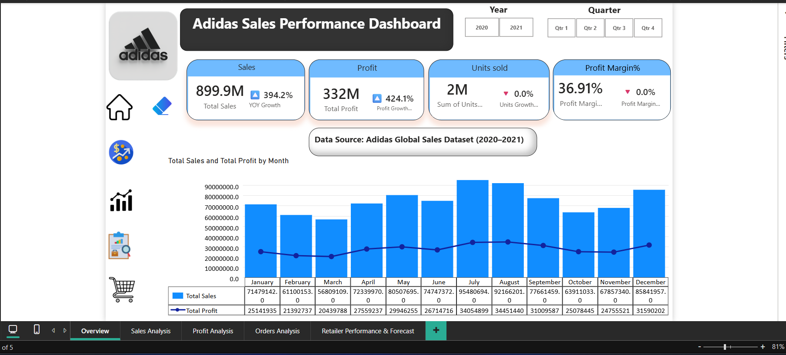
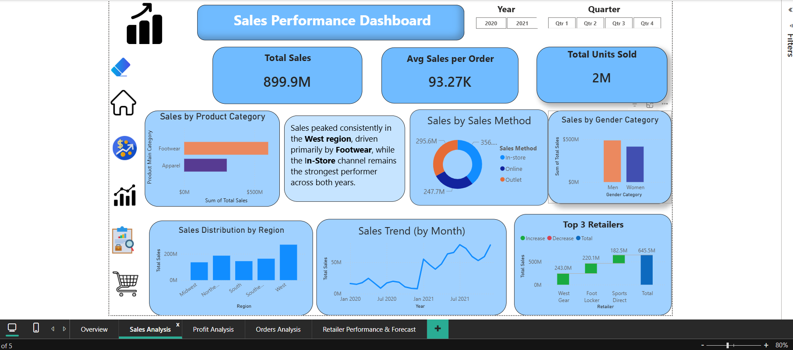
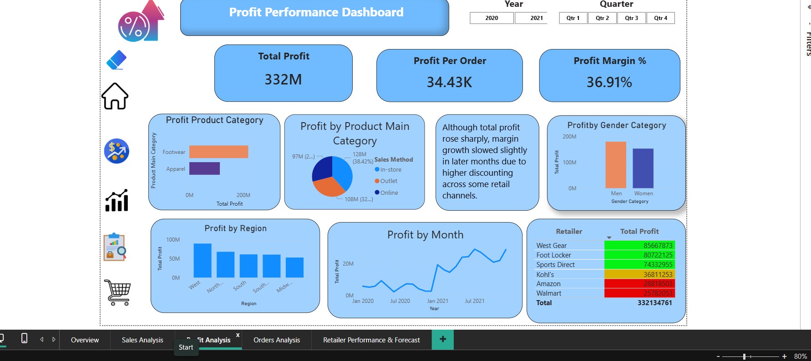
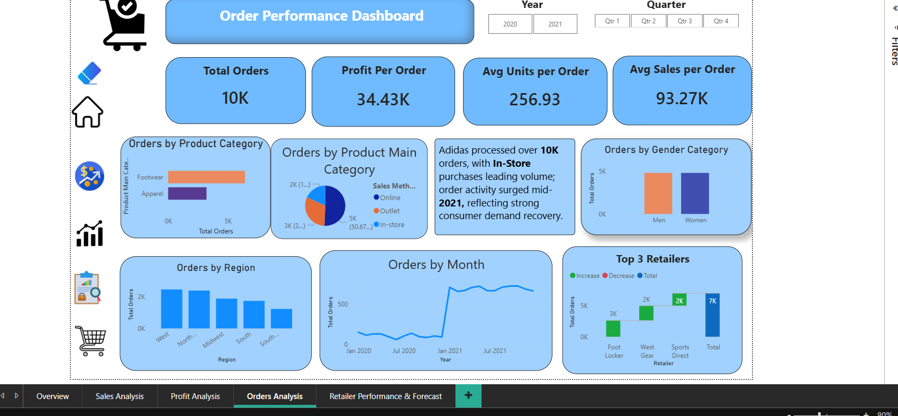
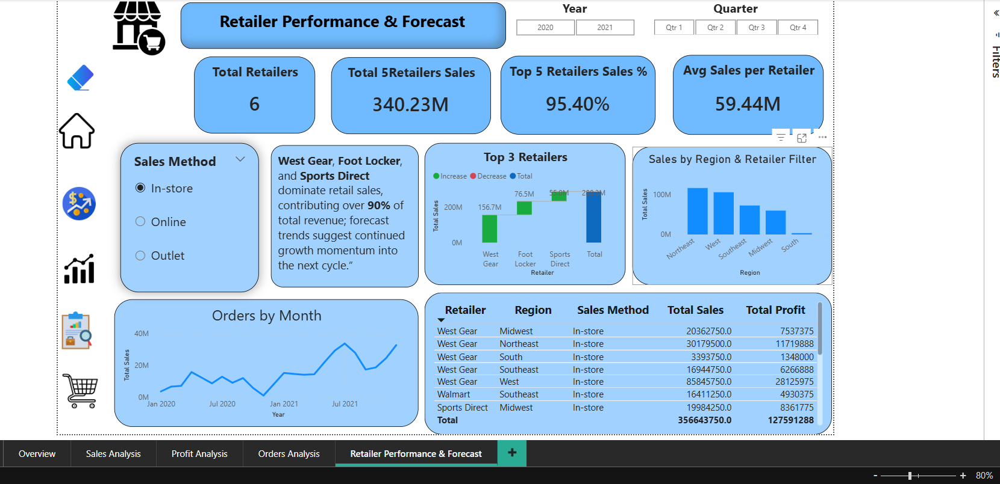

# 📊 Adidas Sales Performance Dashboard (Power BI)

## 🏁 Project Overview
This Power BI project analyzes **Adidas Global Sales Data (2020–2021)** to explore trends in **sales, profit, orders, and retailer performance**.  
The dashboard helps stakeholders understand key business metrics, identify high-performing regions and channels, and assess profitability through interactive visualizations and KPIs.

---

## 🎯 Objectives
- Evaluate **total sales, profit, and order performance** across multiple dimensions  
- Identify **top-performing regions, categories, and retailers**  
- Analyze **sales and profit trends over time (YoY growth)**  
- Measure **profitability and sales contribution** by gender and sales method  
- Provide a **comprehensive, interactive decision-support dashboard**

---

## 🧩 Dashboard Structure
The report contains **5 interactive pages**, each focused on a specific analysis area:

| Page | Description |
|------|--------------|
| **1. Overview** | Displays major KPIs — Total Sales, Profit, Units Sold, Profit Margin % — and trend visualization for Sales & Profit by Month |
| **2. Sales Analysis** | Breaks down Sales performance by Region, Product Category, Gender, and Sales Method, with Top 3 Retailers summary |
| **3. Profit Analysis** | Highlights Profitability trends by Month, Product Category, Gender, and Region, including YoY Profit Growth and Margin insights |
| **4. Orders Analysis** | Tracks Order volumes and averages (Units/Sales per Order), with insights by Product Category, Region, and Gender |
| **5. Retailer Performance & Forecast** | Evaluates Retailer-level performance, Top 5 retailer contribution, and future trend forecast by sales channel |

---

## 🧮 Key KPIs Used
| KPI | Formula (DAX) | Description |
|-----|----------------|-------------|
| **Total Sales** | `SUM('Adidas_Data'[Total Sales])` | Total revenue generated |
| **Total Profit** | `SUM('Adidas_Data'[Total Profit])` | Net profit earned |
| **Total Orders** | `DISTINCTCOUNT('Adidas_Data'[Order ID])` | Count of unique customer orders |
| **Profit Margin %** | `DIVIDE([Total Profit],[Total Sales],0)` | Profitability ratio |
| **Profit per Order** | `DIVIDE([Total Profit],[Total Orders],0)` | Average profit per transaction |
| **Avg Sales per Order** | `DIVIDE([Total Sales],[Total Orders],0)` | Revenue per order |
| **Avg Units per Order** | `DIVIDE([Units Sold],[Total Orders],0)` | Average quantity sold per order |
| **YoY Profit Growth %** | `DIVIDE(([Total Profit]-[Previous Year Profit]),[Previous Year Profit],0)` | Year-over-year profit growth rate |

---

## 📈 Insights Summary
- **West Region** achieved the highest **sales and profit** contribution.  
- **Footwear Category** led total sales, followed by **Apparel**.  
- **In-Store channel** dominated sales share and profit margin performance.  
- **Profit Margin** remained stable at **36.9%**, indicating healthy efficiency.  
- **YoY Profit Growth (424%)** highlighted strong post-pandemic recovery.  
- **Top 3 Retailers** — West Gear, Foot Locker, and Sports Direct — contributed over **90%** of total sales.  
- **Gender Analysis:** Men’s segment slightly outperformed Women’s in both sales and profit.  

---

## 🧠 Data Storytelling Highlights
Each page was designed for **clarity and business interpretation**, not just visualization:
- **Overview Page:** Provides one-glance KPIs and trend monitoring.  
- **Sales Page:** Answers *“Where and what are we selling most?”*  
- **Profit Page:** Explains *“How efficiently are we generating profit?”*  
- **Orders Page:** Tracks *“How customer order volume evolves over time?”*  
- **Retailer Page:** Evaluates *“Who drives our performance and future growth?”*  

---

## 🛠️ Tools & Technologies
| Tool | Purpose |
|------|----------|
| **Microsoft Power BI** | Data modeling, visualization, DAX measures |
| **Microsoft Excel / CSV** | Data source and preprocessing |
| **Power Query (M Language)** | Data cleaning and transformation |
| **DAX (Data Analysis Expressions)** | Custom KPIs and calculated measures |
| **GitHub** | Version control and portfolio showcase |

---

## 🧾 Dataset Information
- **Dataset Name:** Adidas Global Sales Dataset (2020–2021)  
- **Source:** Kaggle / Public Dataset Repository  
- **Data Fields Include:**  
  `Retailer, Region, Country, Sales Method, Order ID, Product, Total Sales, Total Profit, Units Sold, Operating Margin, Date`

> The dataset was cleaned and modeled in Power BI using Power Query, with relationships defined between Orders, Retailers, and Products tables.

---

## 🖼️ Dashboard Preview

#### 🧩 Overview Page

#### 📊 Sales Analysis

#### 💰 Profit Analysis

#### 📦 Orders Analysis

#### 🏪 Retailer Performance & Forecast

---

## 🧭 Navigation Features
- Interactive **Bookmarks & Page Navigation Buttons** for easy movement between pages  
- **Year** and **Quarter slicers** for time-based filtering  
- **Sales Method slicer** to switch between *In-store*, *Online*, and *Outlet*  
- “**Clear Filters**” bookmark button to reset slicers  

---

## 📂 File Structure

Adidas-Sales-Performance-Dashboard/
│
└── Images/
    ├── Overview_Page.png
    ├── Sales_Analysis_Page.png
    ├── Profit_Analysis_Page.png
    ├── Orders_Analysis_Page.png
    └── Retailer_Performance_Page.png
├── Adidas_Sales_Dashboard.pbix
├── Report_Insights.pdf
│
├── Dataset/
│   └── Adidas_Sales_Data.csv
├── README.md

